# ✈️ 김포국제공항 소음대책 RAG 비교 검증 서비스
 
 https://okokp7608-wq.github.io/Rag_Advance_for_Airports/
 
본 프로젝트는 **김포국제공항 소음대책 요약 정보**(`김포공항_소음대책_요약.md`) 데이터셋을 기반으로, 가장 보편적인 **일반형 RAG(Naive RAG)**와 성능이 개선된 **재정렬형 RAG(Advanced RAG with Cohere Rerank)**의 성능 및 답변 품질을 실시간으로 비교 검증할 수 있는 정적 웹 대시보드 애플리케이션입니다.

---

## 1. 과제 구현 항목
- **데이터 청킹 및 적재 자동화**: AI가 파이썬 스크립트(`ingest_gimpo.py`)를 통해 마크다운 헤더를 구조적으로 해석하는 **의미론적 섹션 분할(Section-based Chunking)** 방식을 사용해 33개 청크를 추출하고, OpenAI 임베딩을 생성하여 Supabase 벡터 DB에 사전 적재를 완료하였습니다.
- **RAG 파이프라인 비교 (Naive vs Advanced)**:
  - **Naive RAG**: 질문 임베딩 생성 $\rightarrow$ Supabase 코사인 유사도 기반 벡터 검색(Top 5) $\rightarrow$ OpenRouter LLM 답변 생성.
  - **Advanced RAG**: 질문 임베딩 생성 $\rightarrow$ Supabase 1차 대량 검색(Top 20) $\rightarrow$ Cohere Rerank 다국어 재정렬(Top 5 추출) $\rightarrow$ OpenRouter LLM 답변 생성.
- **실시간성 성능 메트릭 모니터링**: 검색 소요 시간(ms), Rerank 정렬 속도(ms), LLM 답변 생성 속도(ms), 전체 소요 시간(ms)을 병렬 측정하여 시각적 테이블로 제공합니다.
- **UI/UX 대시보드 개발**: 글래스모피즘 테마의 단일 페이지 애플리케이션(SPA) 구조로 개발되어 API Key 설정, 추천 질문 실행, RAG 흐름 추적, 결과 비교, SQL 가이드 등을 한눈에 확인 가능합니다.

---

## 2. 사용 방법
1. **Supabase SQL 설정**: Supabase SQL Editor에서 본 화면 하단의 **SQL DDL 가이드**에 제공된 SQL 스크립트를 실행하여 `ai_rag_documents` 테이블과 `ai_rag_match_documents` RPC 함수를 생성합니다.
2. **데이터 적재**: 터미널에서 다음 명령어를 실행하여 데이터를 벡터화해 적재합니다. (환경변수 `.env` 파일의 키들을 참조합니다)
   ```bash
   python ingest_gimpo.py
   ```
3. **대시보드 실행**: `index.html` 파일을 브라우저로 실행합니다. (또는 Live Server 등의 웹서버로 서빙)
4. **API Key 입력**:
   - **OpenAI API Key**: 질문 임베딩 생성에 사용됩니다.
   - **Cohere API Key**: Advanced RAG의 문서 재정렬에 사용됩니다.
   - **OpenRouter API Key**: Gemini LLM을 연동하여 답변을 생성하는 데 사용됩니다.
5. **질문 실행**: 추천 질문 버튼을 클릭하거나, 검색창에 직접 소음대책 관련 질문을 입력한 후 **질문하기**를 클릭해 두 RAG의 답변 결과를 비교 분석합니다.

---

## 3. RAG 아키텍처 및 시스템 사양

### 시스템 사양 요약
| 구분 | 사양 및 적용 모델 | 설명 |
| :--- | :--- | :--- |
| **Vector DB** | **Supabase (PostgreSQL + pgvector)** | 클라우드 관계형 데이터베이스 및 벡터 익스텐션 연동 |
| **벡터 차원수** | **1536 차원 (Dimension)** | OpenAI 고성능 임베딩 규격 준수 |
| **임베딩 모델** | **OpenAI text-embedding-3-small** | 가격 대비 정확도가 가장 우수한 1536차원 최신 모델 |
| **Re-Rank 모델** | **Cohere Rerank (rerank-multilingual-v3.0)** | 한국어 및 다국어 정렬 능력이 매우 뛰어난 전용 랭킹 모델 |
| **Chat 모델** | **google/gemini-2.5-flash (OpenRouter)** | 속도가 빠르고 컨텍스트 처리량이 넓은 차세대 Gemini 모델 |
| **배포 환경** | **Static Web App (HTML, CSS, JS)** | 서버리스(Serverless) 브라우저 구동 환경 (GitHub Pages 배포 최적화) |

---
## 4. 청킹(Chunking) 전략

* **방식**: **Markdown Header-based JSON Chunking**
* **입력 파일**: `김포공항_소음대책_요약.md`
* **변환 방식**: Markdown 문서의 `##` 및 `###` 헤더를 기준으로 섹션을 분리한 뒤, 각 섹션을 독립적인 JSON 객체로 변환합니다.
* **JSON 구조**: 각 청크는 `chunk_id`, `document_title`, `chapter`, `section`, `article_title`, `content`, `source_path` 필드를 가집니다.
* **맥락 유지(Context Preservation)**: `source_path`에 문서 제목부터 상위 장, 하위 섹션까지의 경로를 저장합니다. 예: `2025 김포국제공항 소음대책 요약 > 6. 소음대책사업 종류 및 기준 > 주택 방음시설 설치사업`
* **Vector DB 적재 방식**:

  * `content`는 embedding 생성 대상 텍스트로 사용합니다.
  * `metadata`에는 `chunk_id`, `document_title`, `chapter`, `section`, `article_title`, `source_path`를 JSON 형태로 저장합니다.
  * `embedding`에는 `content`를 임베딩한 1536차원 벡터를 저장합니다.
* **장점**:

  * Markdown보다 검색 결과의 출처 추적이 쉽습니다.
  * Supabase의 `metadata jsonb` 필터링에 적합합니다.
  * 섹션명, 장 제목, 문서 경로를 함께 보존하므로 RAG 답변 시 환각을 줄일 수 있습니다.
* **결과**: Markdown 문서는 총 30개의 의미 단위 JSON 청크로 변환되었습니다. 각 청크는 법령, 소음대책지역, 연혁, 운항 현황, 지원사업, FAQ, 문의처 등 질의응답에 적합한 단위로 분리되었습니다.

---

## 5. RAG 처리 흐름 (RAG Processing Flow)

```mermaid
graph TD
    %% Naive RAG Flow
    subgraph Naive RAG Pipeline
        N1[사용자 질문 입력] --> N2[OpenAI 임베딩 생성 <br/> text-embedding-3-small]
        N2 --> N3[Supabase 벡터 검색 <br/> 코사인 유사도 Top 5 추출]
        N3 --> N4[OpenRouter LLM 답변 생성 <br/> google/gemini-2.5-flash]
        N4 --> N5[일반 답변 출력]
    end

    %% Advanced RAG Flow
    subgraph Advanced RAG Pipeline
        A1[사용자 질문 입력] --> A2[OpenAI 임베딩 생성 <br/> text-embedding-3-small]
        A2 --> A3[Supabase 1차 검색 <br/> 대량 후보 Top 20 추출]
        A3 --> A4[Cohere Rerank 재정렬 <br/> 한국어 특화 모델 Top 5 재선택]
        A4 --> A5[OpenRouter LLM 답변 생성 <br/> google/gemini-2.5-flash]
        A5 --> A6[재정렬 정밀 답변 출력]
    end

    style N5 fill:#e0f2fe,stroke:#0284c7,stroke-width:2px;
    style A6 fill:#f3e8ff,stroke:#7c3aed,stroke-width:2px;
```



---

## 6. 주요 파일 구성
```
githup/
│
├── index.html          # 메인 UI 대시보드 마크업 및 구조화 레이아웃
├── style.css           # 글래스모피즘 테마 및 반응형 레이아웃 스타일시트
├── app.js              # Naive/Advanced RAG 비동기 처리 및 API 통신 엔진
│
├── ingest_gimpo.py     # 마크다운 섹션 청킹, 임베딩 생성 및 Supabase 적재 스크립트
├── 김포공항_소음대책_요약.md  # RAG 지식베이스 원천 마크다운 텍스트 파일
└── README.md           # 본 기술 소개 및 매뉴얼 문서 (한글)
```

---

## 7. 보안성 (Security)
- **Zero-Serverless Architecture**: 사용자가 대시보드 화면에 직접 입력한 API Key(OpenAI, Cohere, OpenRouter)는 어떠한 외부 중개 서버나 캐싱 서버로도 송신되지 않으며, 사용자의 브라우저 내 로컬 상태에서 각 API의 공식 게이트웨이로만 다이렉트 HTTPS 비동기 통신(`fetch`)을 수행합니다.
- **임시 키 저장**: 저장 옵션 체크 시 브라우저 내의 안전 격리 저장소인 `localStorage`에만 키가 보관되어 개인 PC 테스트 편의성을 보장합니다.

---

## 8. 검증 결과 및 분석 요약

직접 질문을 입력하여 Naive RAG와 Advanced RAG를 검증한 결과는 다음과 같습니다.

1. **검색 품질의 차이 (환각 제어)**:
   - "하절기 냉방시설 전기료 지원"과 같은 다중 복합 명사 질문의 경우, **Naive RAG**는 단어 일부가 일치하는 덜 중요하거나 유사한 단락(예: TV 수신료, 주민지원 공모사업 등)을 Top 5에 포함시켰습니다.
   - 반면 **Advanced RAG**는 1차적으로 20개의 널널한 후보군을 수집한 뒤 `Cohere Rerank` 모델이 실제 질문의 **한국어 의도와 세부 맥락**을 다시 평가하여 상위 5개를 순수 전기료 관련 청크로 재정렬했습니다. 이로 인해 LLM이 타 지원금액과 혼동하지 않고 정확히 "월 5만원 한도(연 최대 20만원)"라는 사실 정보에 기반해 정밀한 답변을 생산했습니다.

2. **소요 시간 대비 효율성**:
   - **Naive RAG**: 평균 약 **1.2초 ~ 1.8초** (Rerank 비용 없음)
   - **Advanced RAG**: 평균 약 **2.0초 ~ 2.8초** (Rerank API 추가 지연 시간 약 0.5초 발생)
   - **결론**: 실시간 대화 환경에서 0.5초 수준의 Rerank 연산 오버헤드는 품질 향상 폭(잘못된 정보 축소 및 정확한 팩트 전달) 대비 매우 미미하여, 안정적인 대민 서비스 구성에는 **Advanced RAG(Re-Rank형)** 도입이 매우 우월한 것으로 판명되었습니다.
